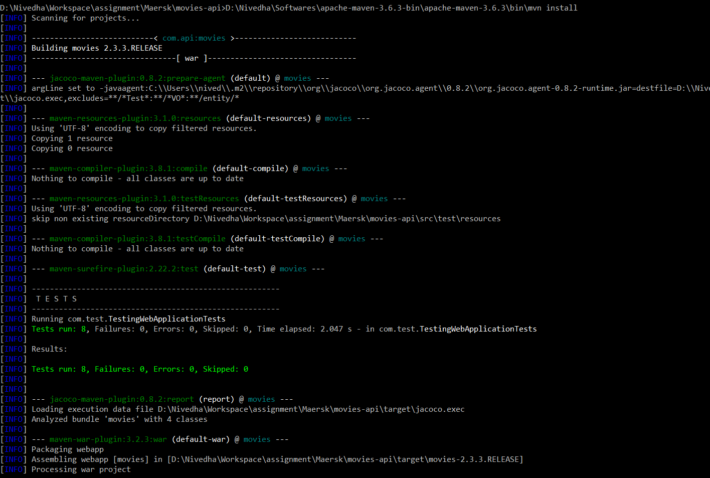
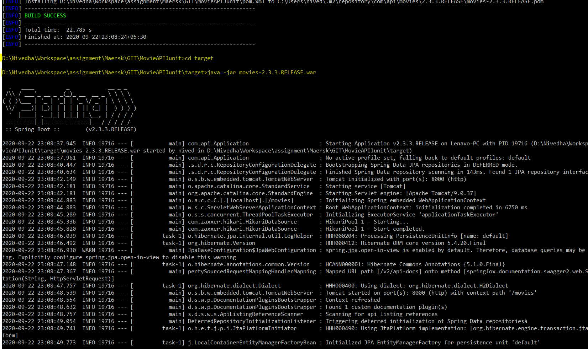
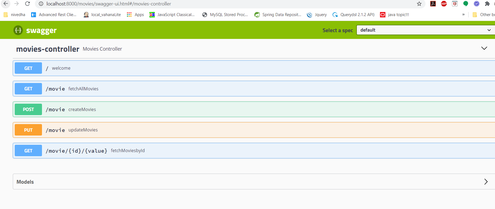
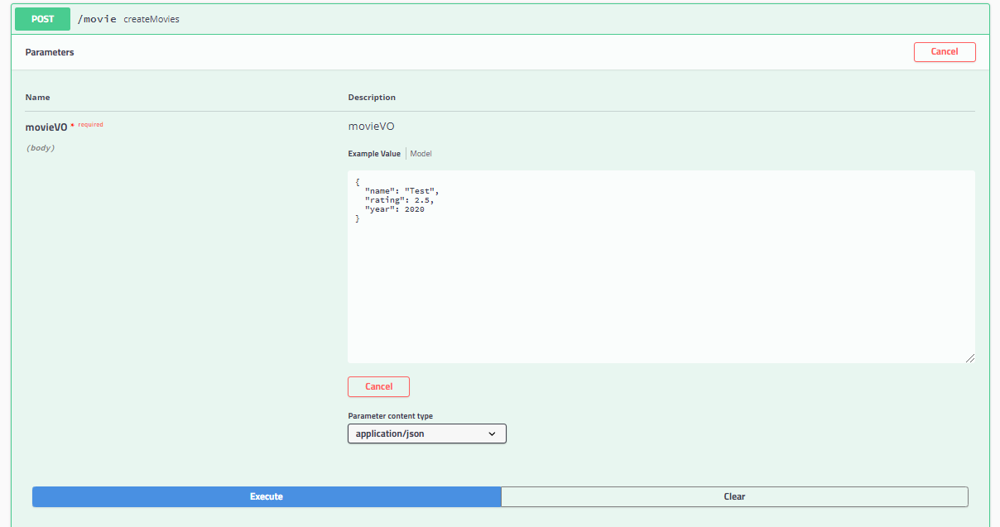
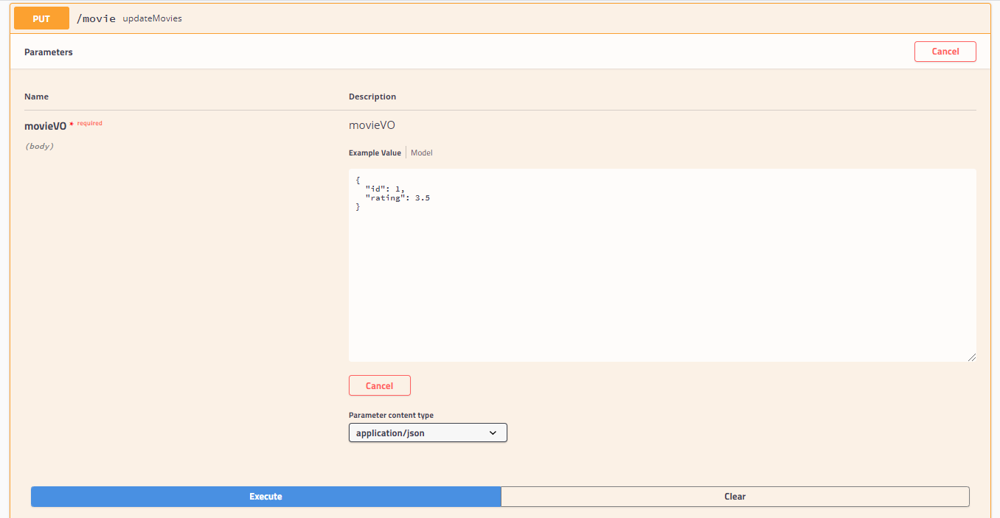
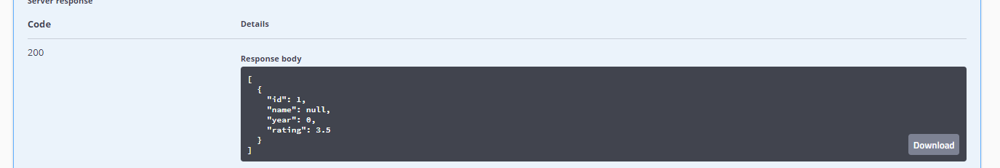
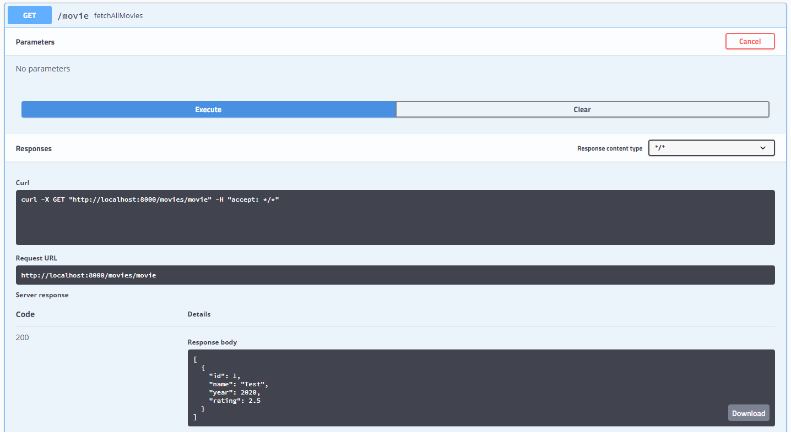
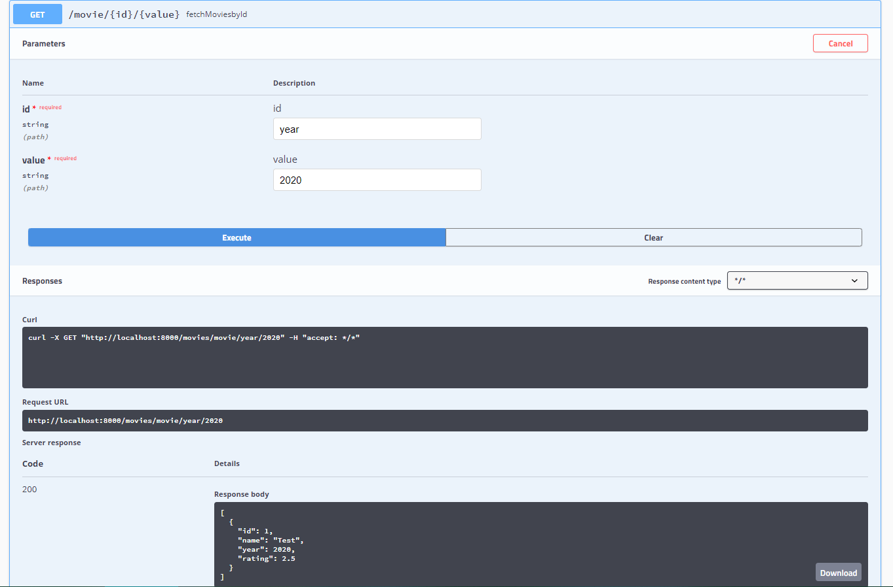
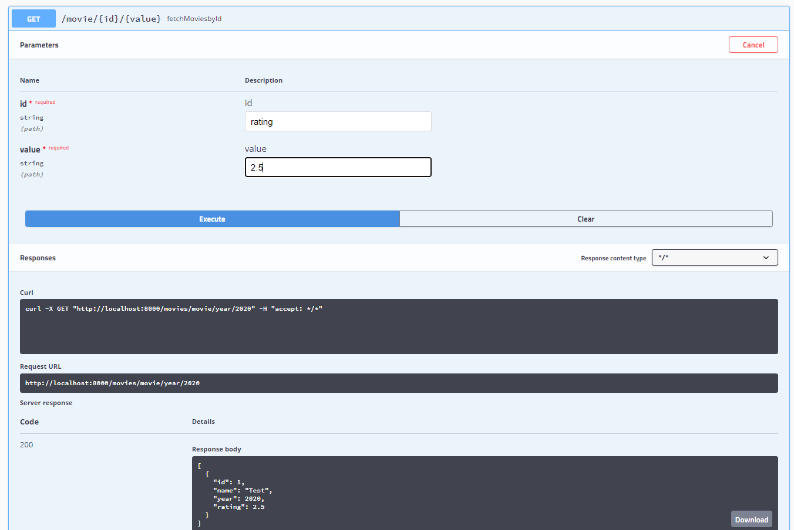
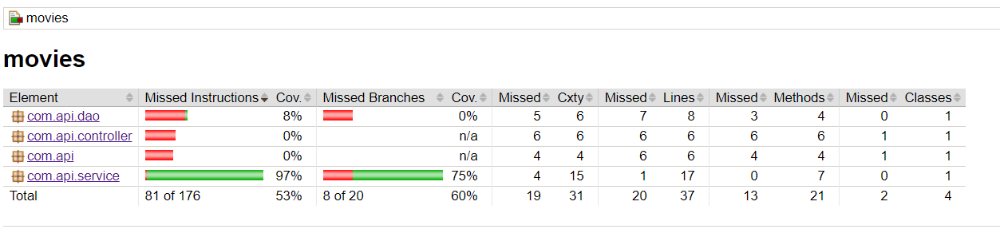

# MovieAPIJunit

## 1) Building WAR file

## 2) Deploy WAR (java -jar movies-2.3.3.RELEASE.war)

## 3) Run URL - http://localhost:8000/movies/swagger-ui.html

## 4)Design & implement an API for 

###### a. Creating movies

###### b. Updating movies

###### c. Fetching all movies

###### d. Fetch movies based on year

###### e. Fetch movies based on ratings

## 5) Test Coverage( under /target/site/jacoco/index.html)

